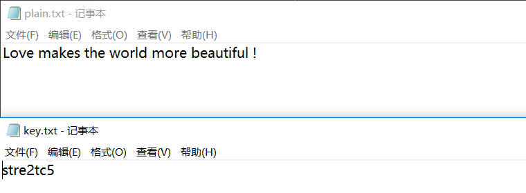
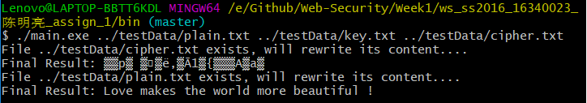
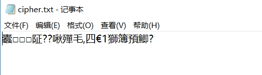
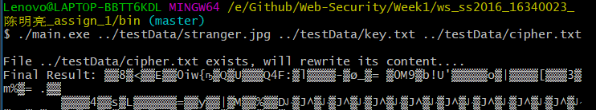
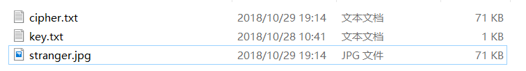

# Web安全技术实验报告 -- DES算法设计与实现

## 姓名：陈明亮

## 学号：16340023

### 1. 实验需求
* 使用编程语言实现DES算法，结合课堂教学资料编写代码，完成DES加密明文，解密密文的功能。

* 要求在算法编写的过程中，将DES算法模块化，加密解密步骤结构化，最终输出运行测试结果。

* 编写DES算法原理概述实验报告，在报告中阐述编程实现思想与过程，展示结果。


### 2. 实验原理概述
1. DES(Data Encryption Standard)是一种使用对称密钥加密的块加密算法。实验过程中采用的是基于56位密钥的实现，同时将64位视为分组长度，划分明文中的64位为一块，作为算法的输入，经由加密过程输出64位长度的密文。

   ​

2. 如此循环往复，所需加密的明文就可以被分为若干块逐一进行加密，其中所依赖的密钥均相同，输入密钥为64位，但每八位的最后一位均为奇偶校验位，如此一来有效密钥长度就为56位。

   ​

3. DES的加密算法过程可以采用Feistel结构实现，分为以下5步：
  * PKCS#5规范填充

    原始密文信息最后的分组不足8字节时(64位)，采用填充字节法增加长度，所填入的自己取值相同，都是当前缺少的字节数，保证分组加密解密过程的可执行性。

  * 16子密钥生成

    根据获得的64位密钥推算出16个子密钥，经由PC_1矩阵置换得到初始左右两边初始28位密钥，经由循环左移运算后进行PC_2矩阵压缩，获得每一轮子密钥。

  * 初始置换$IP$

    根据固定的初始变换矩阵IP，重排每一块输入的64位明文。

  * 16轮迭代T(加密过程顺序调度16个子密钥，解密过程逆向调度16个子密钥)

    结合IP置换之后的明文左部分与右部分，采用Feistel轮函数结合每一轮密钥进行新一轮右部分的生成，旧右部分取代作为新一轮的左部分。经过16轮迭代，左右交换输出加密结果。

  * 逆置换$IP^{-1}$

    对上一步输出的二进制串进行IP逆置换，得到最终的64位密文。


### 3. 实验架构设计

* 编程语言：Go

* 编程思想：OOP

* 编程细节：
  1. 代码采取Go语言面向对象编程结构，首先定义名为`DES_Processor`结构体，使用拟类写法定义结构体的内部变量与成员方法。

  2. 划分算法原理中的每一步，封装为类的成员方法，单个成员方法内部执行相应功能。为更好地体现编程逻辑，以下贴出伪代码：

     ```c++
     DES_Processor dester;
     dester.GainInput();  // 获取输入明文(或密文)，获取输入密钥
     dester.PCKS5Adding();  // 运行PCKS#5规范填充输入明文(或密文)
     dester.generateSubKeys();  // 运行16轮子密钥生成
     // 以64位长度分组明文，进行每一块明文的独立加密(或密文的独立解密)
     for i := [0, blockLen] {
     	dester.IP_Permutation();  // IP置换
     	dester.T_Iteration(flag);  // 16轮T迭代，根据flag输入决策加密操作，还是解密操作
     	result[i] = dester.IP_Reverse_Permutation(); // 运行IP逆置换，得出该块对应的密文(或明文)
     }
     ```

  3. 根据以上伪代码，实际上我们可以清晰地看到，加密与解密的过程不同点就在于操作的文件数据，以及进行16轮T迭代时执行的密钥调度顺序不同。在真正的代码编写中，我们可以根据输入的布尔型`Flag`判断当前进行的功能，保证代码的可重用性。

  4. 代码实现位存储的数据结构采取数组形式，一般的输入输出结果采用字符串型`string`存储，整体的Go语言类存储结构采取`struct`类型。

     ​

* 模块分解：(分析难点模块函数实现)

  1. 初始的文件读写逻辑(部分代码)

     ```go
     // 1. Open Target File
     file, err := os.Open(inFile);
     if err != nil {
         fmt.Fprintf(os.Stderr, "File Opening Error: %s does not exist!\n", inFile);
         os.Exit(2);
     }
     defer file.Close();
     // Load file size
     fileInfo, err := file.Stat();
     if err != nil {
         fmt.Fprintf(os.Stderr, "File Status Error: %s has error status!\n", inFile);
         os.Exit(2);
     }
     fileSize := fileInfo.Size();
     buffer := make([]byte, fileSize);
     // Read Input File
     file.Read(buffer);
     ```

     分析：结合Go语言的os包，进行命令行输入参数：明文文件路径，密钥文件路径，密文存储路径的文件读取，数据输入，同时保证错误的正确`catch`

     ​

  2.  PCKS#5规范填充

     ```go
     // PCKS#5 Adding
     func (d *DES_Processor) PCKSAdding(){
         count := 8 - (len(d.message) % 8);
         for i:=0; i<count; i++ {
         d.message += string(count);
         }
     }
     ```

     分析：填充目标对象内部明文存储变量的长度，填充内容为当前距离完成的位数。

     ​

  3. 16轮子密钥生成(部分代码)

     ```go
     // Drop eight parity bits
     for i:=0; i<56; i++ {
     	realKey[55-i] = d.secretKey[64 - PC_1[i]];
     }
     // Sixteen times subKey generating
     for time:=0; time<16; time++ {
     // Divide 56 bits key into two parts
     	for i:=0; i<28; i++ {
     		leftKey[i] = realKey[i+28];
     		rightKey[i] = realKey[i];
     	}
     	Left_Shift_bits(&leftKey, time);
     	Left_Shift_bits(&rightKey, time);
         // Comnination and Compression
         for i:=0; i<28; i++ {
             realKey[i+28] = leftKey[i];
             realKey[i] = rightKey[i]; 
         }
         for i:=0; i<48; i++ {
             result[47-i] = realKey[56 - PC_2[i]];
     	}
     // One Round SubKey generate finish
     d.subKeys[time] = result;
     }
     ```

     分析：16子密钥生成涉及左半部分与右半部分的生成与替换。在进入生成循环之前，需要根据PC_1矩阵进行奇偶校验位的去除。对于每一轮生成，首先根据上一轮的结果，对当前左右部分进行循环左移，其次进行PC_2压缩操作，更新当前子密钥结果。

     ​

  4. Feistel轮函数

     ```go
     func Feistel(input_R [32]int, input_k [48]int) (result_ [32]int) {
     	var (
     		result [32]int
     		expand_R [48]int
     		count int = 0
     	)
     	for i:=0; i<48; i++ {
     		expand_R[47-i] = input_R[32-Ex_Table[i]];
     	}
     	for i:=0; i<48; i++ {
     		expand_R[i] = expand_R[i] ^ input_k[i];
     	}
     	// S_Box Transform
     	for i:=0; i<48; i+=6 {
     		row := expand_R[47-i] * 2 + expand_R[47-i-5];
     		col := expand_R[47-i-1] * 8 + expand_R[47-i-2] * 4 + 
            						 expand_R[47-i-3] * 2 + expand_R[47-i-4];
     		for index, target := 0, S_Box[i/6][row][col]; index <= 3; index++ {
     			var tmp int = target % 2;
     			result[31-count-index] = tmp;
     			target = target / 2;
     		}
     		count += 4;
     	}
     	// P-Permutation
     	var temp [32]int = result;
     	for i:=0; i<32; i++ {
     		result[31-i] = temp[32-P_Box[i]];
     	}
     	return result;
     }
     ```

     分析：将长度为32的位数组做E-扩展，使其成为48位数组，结合输入的48位子密钥，按位异或运算。所得结果平均分成八个分组，进行S-Box转换，获取八个4位长度分组，顺序连接获取初始结果。最终采取P-置换矩阵，转换之后输出最终32位数组结果。

     ​

  5. 16轮T迭代

     ```go
     // Second Step of class DES-Process --- T Iteration
     func (d *DES_Processor) T_Iteration(process [64]int, target *[64]int, type_ bool){
     	var (
     		leftP [32]int
     		rightP [32]int
     	)
     	// Initialize L1 And R1
     	for i:=0; i<32; i++ {
     		leftP[i] = process[i+32];
     		rightP[i] = process[i];
     	}
     	// 16 T-Iteration
     	for round:=0; round<16; round++ {
     		var index int = round;
     		if type_ == true{
     			index = 15-round;
     		}
     		tmp := rightP;
     		FeistelRes := Feistel(rightP, d.subKeys[index]);
     		for i:=0; i<32; i++ {
     			rightP[i] = leftP[i] ^ FeistelRes[i];  // XOR
     		}
     		leftP = tmp;
     	}
     	// Combine L16, R16 into R16L16
     	for i:=0; i<32; i++ {
     		(*target)[i] = leftP[i];
     		(*target)[i+32] = rightP[i];
     	}
     }
     ```

     分析：结合输入的输入的过程判断(加密还是解密)，首先将输入源二进制数组分为左右两部分，然后进行16轮左右部分迭代变换。根据之前的Feistel轮函数，每一轮迭代中采取上一轮的左部分`left`与`Feistel_result`进行异或运算，更新本轮`right`，上一轮的`right`直接继承为本轮的`left`。迭代完成之后，互换左右位置作为迭代输出。

     ​

### 4. 实验结果展示

1. 程序使用方法

   进入代码bin目录，打开终端，执行以下命令

   ```shell
   ./main.exe ../testData/plain.txt ../testData/key.txt ../testData/cipher.txt
   ```

   分析：程序接收三个输入参数，分别对应明文，密钥，密文文件输入路径，执行程序之后自动开启加密操作，同时加密完成之后执行解密操作，在终端分别会打印加密、解密的文本输出。

   ​

2. 测试结果

   1. 文本输入测试

      程序明文：Love makes the world more beautiful !

      程序密钥：stre2Tc5

      

      执行结果：(密文有些许非常见字符，终端显示效果差)

      

      ​	(写入密文文件结果)

      ​	

      ​

   2. 图片文件输入测试

      输入图片：(stranger.jpg)

      

      程序密钥：stre2Tc5

      执行结果：(终端结果太长，只放一部分)

      

      

      解密图片写回时间：

      

         分析：加密解密写回时间相同，结果验证正确