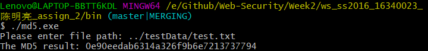
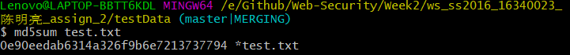
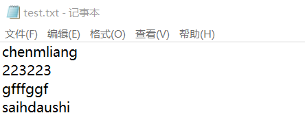
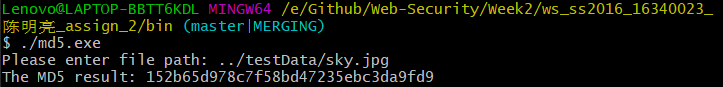
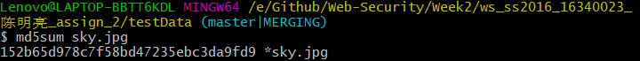
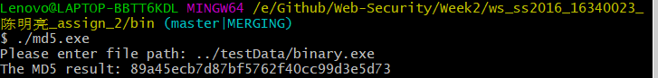
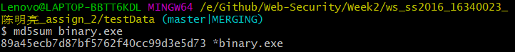

# Web安全技术实验报告 -- MD5算法设计与实现

## 姓名：陈明亮

## 学号：16340023


### 一、实验需求
* 使用编程语言实现MD5算法的程序设计与实现，结合课程教学资料，完成对输入明文的MD5算法进行加密，输出MD5密文功能程序

* 算法设计过程需模块化，阐述相关模块运行功能，以及步骤结果分析，最终与现成的MD5工具加密结果进行比较，确认结果正确性。

* 实验进阶需求，个人认为应该进行性能上的测试，以及实验出现问题的反思。


### 二、实验原理概述

1. MD5算法即`Message-Digest Algorithm 5`，信息摘要算法5。此算法是由`Ron Rivest`发明的，用于确保信息传输完整性和一致性的`Hash`算法。

2. MD5算法可以接受任意不定长的信息输入，然后进行512位长度的固定分组，过程存储数据均采取小端模式，生成4个32位数据之后，进行联合输出，最终获取128位的信息摘要密文。

3. MD5算法的基本过程为：填充、分块、缓冲区初始化、循环压缩、最终得出加密结果：
  * 填充(Padding)

    首先接收原始消息明文，进行分块之前的数据填充。此处的填充需要使最终数据位长度符合：`K + P == 448(mod 512)`，算式内部的K为原始明文长度，P为算法需要填充的数据段长度。最终向填充好的消息尾部加上原本K长度明文的低64位，最后得到符合`K + P + 64 == 0(mod 512`的初始消息。

  * 分块(Grouping)

    将填充之后的消息结果分割为多个512位长的数据分组：`Y_0, Y_1, Y_2,...., Y_l`

  * 缓冲区初始化(Buffer-Initializing)

    初始化一个存储128位长数据的MD缓冲区，内部表示为4个32位长度的寄存器，分别存储不同段的数据值。缓冲区初始状态需要接收外部的初始向量`IV`输入，置4个寄存器初值，然后进行缓冲区内部的迭代操作，每一步迭代采用循环压缩函数`H_MD5(CV_i-1, Y_i)`，更新当前缓冲区的寄存器数值，最后一步的迭代结果即是MD5算法输出密文。

  * MD5循环压缩(HMD5)

    循环压缩函数接收128位的缓冲区寄存器数据，同时接收明文消息的512分组，进行当前4轮循环操作，分别为：`F, G, H, I`。结合每轮循环的迭代操作逻辑，运算得出该轮循环结果并输出。

4. 完成上述步骤之后，MD5算法的所有操作执行完毕，最终的缓冲区迭代结果即为输出的MD5密文。


### 三、实验架构设计

* 编程语言：C++

* 编程思想：OOP

* 程序设计架构：
  1. 程序主体为类`MD5_Processor`，该类内部包括算法运行的变量存储，以及相关的算法函数的实现。为了便于测试，以及用户友好度提升，采用输入文件名，读取目标文件内容的方法启动加密行为。

     ```C++
     int main(){
         string path;
         cout << "Please enter file path: ";
         cin >> path;
         MD5_Processor mp(path);
         mp.MD5_Init();
         unsigned char* plain = mp.getPlainText();

         mp.MD5_Update(plain, mp.getLength());
         mp.MD5_Final();

         return 0;
     }
     ```

     ​

  2. 可以看到运行算法代码中包含的多个方法的调用，此处将算法内部的步骤划分为类对象的不同方法，按顺序执行得到相应的MD5加密结果。

  3. 程序声明结构体类型`MD5_Meta`，负责存储缓冲区操作时涉及的变量数组，其中包括：缓冲区寄存器状态`state`，缓冲区迭代临时数值`buffer`，当前处理分组计数`number`。

     ```C++
     struct MD5_Meta{
     	unsigned char buffer[64];
     	unsigned int state[4];
     	unsigned int number[2];
     };
     ```

  4. 运用C++语法的`define`功能，简化循环压缩过程中的四则压缩生成函数。

     ```C++
     #define F(x,y,z) ((x&y)|(~x&z))
     #define G(x,y,z) ((x&z)|(y&~z))
     #define H(x,y,z) (x^y^z)
     #define I(x,y,z) (y^(x|~z))
     #define ROTATE_LEFT(x,n) ((x<<n)|(x>>(32-n)))
     #define FF(a,b,c,d,x,s,ac) { a+=F(b,c,d)+x+ac; a=ROTATE_LEFT(a,s); a+=b;}
     #define GG(a,b,c,d,x,s,ac) { a+=G(b,c,d)+x+ac; a=ROTATE_LEFT(a,s); a+=b;}
     #define HH(a,b,c,d,x,s,ac) { a+=H(b,c,d)+x+ac; a=ROTATE_LEFT(a,s); a+=b;}
     #define II(a,b,c,d,x,s,ac) { a+=I(b,c,d)+x+ac; a=ROTATE_LEFT(a,s); a+=b;}
     ```

     ​

* 程序模块分解(算法实现难点解析)

  1. C++读取整个目标文件内容，按二进制流方式读取

     ```c++
     ifstream file(filePath.data(), ios::binary);
     if(file.is_open()){
         ss << file.rdbuf();
         str = ss.str();
         vector<unsigned char> store;
         for(int i=0; i<str.size(); i++)
         	store.push_back(str[i]);
         int i = 0;
         for(i=0; i<store.size(); i++){
         	this->plainText[i] = store[i];
         }
         this->length = store.size();
         file.close();
         }else {
         cout << "[Error] Error when opening file: " << filePath << endl;
     }
     ```

     分析：此处遇到的问题是数组的'\0'问题，如果遇到读取的不是文本文件，而是其余文件时，数组内部有时候会存储'\0'终止符，导致无法读取完整的文件内容。同时此处还需要进行二进制方式读取，否则会出现windows平台下加密结果不正确的情况(下文会详细讲解)。

     解决方法：借助`vector`辅助获取完整内容的长度，进行基于原本长度的读取操作。

     ​

  2. 每一轮缓冲区迭代函数(部分代码)

     ```c++
     // Make the front 64 to store length
     meta.number[0] += len<<3;
     if(meta.number[0] < (len<<3)) 
     	meta.number[1]++;
     meta.number[1] += len>>29;

     if(len>=partlen){
     	memcpy(&meta.buffer[index], input, partlen);
     	MD5_Transform(meta.state, meta.buffer);
     	// one group for 512 bits
     	for(i=partlen; i<= len-64;i+=64){
     		MD5_Transform(meta.state, &input[i]);
     	}
     	index=0;
     }
     else i=0;
     memcpy(&meta.buffer[index], &input[i], len-i);
     ```

     分析：此处的迭代函数`MD5_Update`完全执行了缓冲区于当前`meta.buffer`与512位分组的循环压缩操作，其中`meta.buffer`就是上文提到的128位存储结果缓冲。上述程序首先进行分组号的递增，然后运行`MD5_Transform`进行16 X 4轮迭代操作，更新当前寄存器的数值，同时更新`buffer`内容。

  ​

  3. 数组转换函数

     ```c++
     // Encode input array to output
     void MD5_Processor::MD5_Encode(unsigned char* outArray, unsigned int* inArray, int len){
     	int i = 0, j = 0;
         while(j<len){
             outArray[j] = inArray[i] & 0xFF;
             outArray[j+1] = (inArray[i] >> 8) & 0xFF;
             outArray[j+2] = (inArray[i] >> 16) & 0xFF;
             outArray[j+3] = (inArray[i] >> 24) & 0xFF;
             i++;
             j += 4;
         }
     }

     void MD5_Processor::MD5_Decode(unsigned int* x, unsigned char* buff, int len){
     	int i = 0, j = 0;
         while(j < len){
             x[i] = (buff[j]) | (buff[j + 1] << 8) | (buff[j + 2] << 16) | (buff[j + 3] << 24);
             i++;
             j += 4;
         }
     }
     ```

     分析：此处分别将操作中换取的`unsigned char*`与`unsigned int*`数组进行相互转换，运用到的地方是进行循环压缩时的类型转换，因为4个寄存器的存储类型为`int`，然而存储数据的数组为`unsigned char`。函数中运用移位与操作，进行类型转换，同时设定长度进行定长变换，从而避免数组越界。

  ​

  4. 算法控制处理迭代函数

     ```c++
     // Final process function
     void MD5_Processor::MD5_Final(bool flag){
     	int index, paddingLen;
         unsigned char tempBits[8];
         index = (meta.number[0] >> 3) & 0x3F;
         // Make padding
         paddingLen = (index < 56) ? (56-index) : (120-index);
         // 16 bytes update
         MD5_Encode(tempBits, meta.number, 8);
         MD5_Update(Padding, paddingLen);
         // 32 bytes update
         MD5_Update(tempBits, 8);
         MD5_Encode(this->cipherText, meta.state, 16);
         // Print result
         if(flag){
             cout << "The MD5 result: ";
             for(int i=0; i<16; i++){
                 printf("%02x", this->cipherText[i]);
             }
         }
     }
     ```

     分析：本函数进行填充分组操作，同时调用对象内部的方法进行缓冲区更新，以及数组转换等操作最终负责输出结果。


### 四、实验结果展示

1. 程序执行方式

   进入根目录下`bin`文件夹，可以看到有`md5.exe`和`md5Test.exe`两个可执行文件，使用方法分别为：

   ```shell
   $ ./md5.exe
   Please enter file path: ....    #输入对应加密文件的相对路径, 如../testData/test.txt
   The MD5 Result: ....

   $ ./md5Test.exe
   ....
   ```

   分析：`md5.exe`接收加密文件路径，读取文件内容并进行加密操作，输出MD5之后的128位信息摘要。`md5Test.exe`不接受输入参数，执行算法速度测试，测试文件为图片文件，测试大小规模为`50000 X 20000KB`，最终输出测试完成所需时间。

   ​

2. 程序执行结果正确性比较

   * 对文本文件的MD5加密

     本程序执行结果：

     

     md5sum工具执行结果：

     ​	

     目标文本文件内容：

     `	

     结果分析：通过比较可以看出，本程序MD5算法处理文本文件内容，输出的加密信息摘要`MD5 result`正确，与标准的MD5工具`md5sum`输出结果相同。

     ​

   * 对图片文件的MD5加密

     本程序执行结果：

     ​	

     md5sum工具执行结果：

     ​	

     源文件：

     ​	

     结果分析：通过比较也可以确认，本程序在处理图片文件，读取其内容进行MD5之后，也能够输出正确的MD5处理结果。

     ​

   * 对二进制文件的MD5加密

     本程序执行结果：

     ​	

     md5Sum工具执行结果：

     ​	

     ​

   * 实验结果输出MD5值均与标准MD5工具输出相同，实验结果正确。


### 五、实验反思

1. 本次实验是Web安全课程的第二次代码设计作业，要求实现MD5算法的程序架构与实现，最终得出可执行程序，求出文件的正确MD5值。参考老师提供的资料，实际上算法设计的思路较为清晰，实现结果也较好。

   ​

2. 实际上实验过程中也遇到了问题，其中一个最为`坑`的一个问题就是：Windows平台下与·Linux平台下的同一文件的MD5输出值不同，所以一开始本程序的MD5结果值是与Windows下自带`md5Sum`工具的结果有些出入的。最终进行仔细查找之后，发现：`Windows平台下文件采取\r\n进行换行操作，而Linux下只有\n`，这就是问题的根源所在。

   解决方法：不采取文本模式读取文件，而是将文件转换为二进制流读入操作数组，就可以完全避免换行符不同而引起的结果不同了。

   ​


