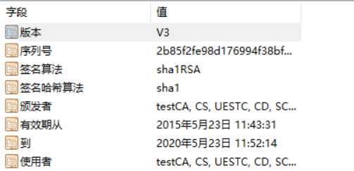
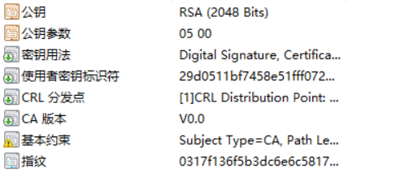
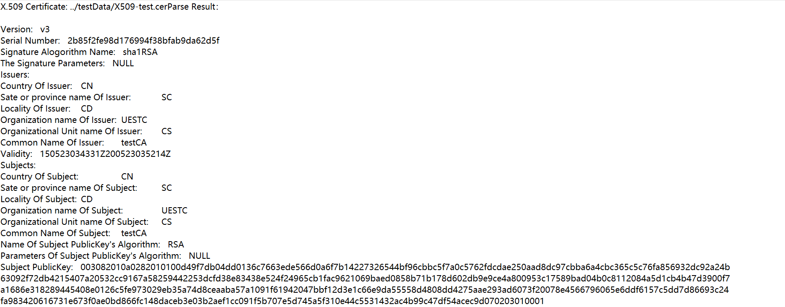
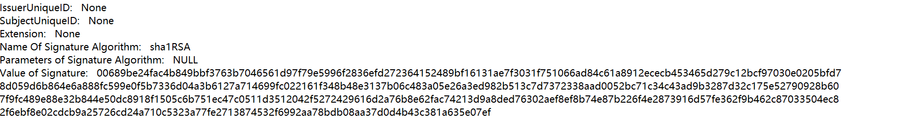
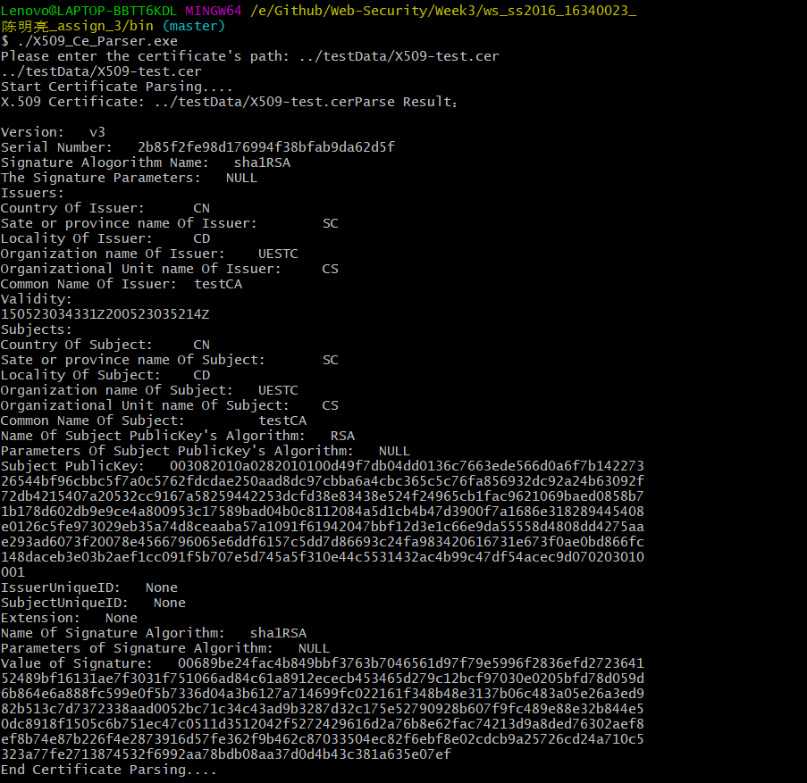

# Web Security 实验报告 -- X.509数字证书解析算法与实现


## 姓名：陈明亮

## 学号：16340023


### 一、实验需求

* 使用编程语言`C++`实现X.509标准数字证书的读取，按照标准证书的定义解析出证书相关项目的英文内容陈述，同时显示对应的证书读取结果，验证结果正确性。
* 标准证书读取程序需要实现对应于证书内容相应条目的数据结构定义，方便进行条目内容的读取、存储与输出。
* 要求理解X.509证书内容条目读取规律，保证正确读取证书内的各项信息，并与标准证书信息进行比较，验证结果正确性。


### 二、实验原理概述

1. X.509是当前广泛应用的数字证书标准，是由国际电联电信委员会(ITU-T)制定的，用于单点登录和授权管理基础设施的PKI标准，用于定义公钥证书，属性证书等等证书标准。

   ​

2. X.509证书的内容读取涵盖证书内容的多个特殊字段，以及对应的字段值。证书采用`ASN1`进行编码，采用一个一个的数据块来描述整个证书数据结构。进行证书内容读取之时，需要根据标识字符进行数据块的结构类型判断，判断完成之后才能根据不同结构进行数据块长度，数据块字段名，数据块字段值的读取与存储。此处根据`ASN1`编码方式，我们可以采用`TLV`方法进行数据读取，顺序为`type, length, value`，依次得到对应条目内容。

   ​

3. 通过对标识字节的读取，我们可以首先确定X.509证书某项字段值的类型，如：`INTEGER`、`STRING`、`SEQUENCE`等等，其后紧接着数据块长度的数值(以十六进制数存储)，若遇到`0x80`特殊情况，表示数据块长度不定，以`0x00`结束数据块内容，最后当然接着数据块本身存储的字段名，字段内容等二进制内容，此处只需要根据数据块初始信息进行读取即可。证书的读取过程正是以上过程的循环，直到证书读取结束。

   * `BOOLEAN`类型编码：`01`，取值为`Ture or False`，对应的`value`为FF 或 00
   * `INTEGER`类型编码：`02`，分为`短形式`与`长形式`，需要存储在不同长度的数组中，同时也存在正负性
   * `SEQUENCE`类型编码：`03`，任意长度的`ASCII`字符串
   * `OBJECT`类型编码：其余可能编码

   ​

4. X.509证书的总体结构分为两部分：  1) 证书基本信息     2) 证书扩展信息

   * 证书基本信息包含：证书的发行版本号，证书序列号(标识证书的唯一整数串)，证书签名(证书签名信息，证书签名算法种类)，证书颁布者标识，证书有效期，证书主题，证书公钥信息，证书公钥加密算法标识符，证书主体唯一标识符。

   * 证书扩展信息包含：发行者密钥标识符，私钥使用期限，主体别名，颁发者别名信息等

     ​

5. X.509证书整体详细描述可以概括为：

```C++
Certificate ::= SEQUENCE {
	// 证书主体
	tbsCertificate TBSCertificate,
	// 证书签名算法结构
	signatureAlgorithm AlgorithmIdentifier,
	// 证书签名值,是证书签名算法对证书主体部分进行签名之后，生成的签名值
	signatureValue BIT STRING
}
```
证书结构中的证书主体为`TBS`类型，该主体中存储了证书的其余重要信息：
```C++
TBSCertificate ::= SEQUENCE {
	// 证书版本号
	version [0] EXPLICIT Version DEFAULT v1,
	// 证书序列号，对同一CA所颁发的证书，序列号唯一标识证书
	serialNumber CertificateSerialNumber,
	// 证书签名算法标识
	signature AlgorithmIdentifier,
	// 证书发行者名称，以及相关信息
	issuer Name,
	// 证书有效期
	validity Validity,
	// 证书主体名称
	subject Name,
	// 证书公钥
	subjectPublicKeyInfo SubjectPublicKeyInfo,
	// 证书发行者ID(可选)，只在证书版本2、3中才有
	issuerUniqueID [1] IMPLICIT UniqueIdentifier OPTIONAL,
	// 证书主体ID(可选)，只在证书版本2、3中才有
	subjectUniqueID [2] IMPLICIT UniqueIdentifier OPTIONAL,
	// 证书扩展段（可选），只在证书版本3中才有
	extensions [3] EXPLICIT Extensions OPTIONAL
}

// 证书的版本号
Version ::= INTEGER { 
	v1(0), 
	v2(1), 
	v3(2) 
}

// 证书对应的唯一序列号
CertificateSerialNumber ::= INTEGER

AlgorithmIdentifier ::= SEQUENCE {
	// 证书签名算法名称
	algorithm OBJECT IDENTIFIER,
	// 证书签名算法所需参数
	parameters ANY DEFINED BY algorithm OPTIONAL 
}

// 用于存储算法所需参数
Parameters ::= SEQUENCE {
	params []INTEGER
}

// 签名算法执行产生签名值
SignatureValue ::= SEQUENCE {
	values []INTEGER
}

// 证书颁布者姓名
Name ::= CHOICE {
	name SEQUENCE
}

// 证书有效期
Validity ::= SEQUENCE {
	// 证书有效期起始时间
	notBefore Time,
	// 证书有效期结束时间
	notAfter Time
}

// 时间
Time ::= CHOICE {

	utcTime UTCTime,

	generalTime GeneralizedTime 
}

// 证书公钥信息存储
SubjectPublicKeyInfo ::= SEQUENCE {
	// 公钥加密算法名称
	algorithm AlgorithmIdentifier,
	// 公钥内容
	subjectPublicKey BIT STRING
}

// 公钥类型定义
PublicKey ::= SEQUENCE {
	modulus INTEGER, 
	publicExponent INTEGER
}

// 证书扩展信息
Extensions ::= SEQUENCE SIZE (1..MAX) OF Extension

Extension ::= SEQUENCE {
	extnID OBJECT IDENTIFIER,
	critical BOOLEAN DEFAULT FALSE,
	extnValue OCTET STRING 
}
```


### 三、实验架构设计

* 编程语言：`C++`

* 编程思想：`OOP`

* 程序设计架构：
  1. 程序主体为类`CeParser`，该类包含证书各项条目的结构体定义，具体定义内容与上文实验原理的结构阐述相同，X.509证书主体结构定义如下：

     ```c++
     struct X509Certificate{
     	TbsCertificate certificate;
     	SignatureAlgorithm CAS_Algorithm;
     	SignatureValue CAS_Value;
     };
     ```

     其中的`TBS`证书主体定义为：

     ```c++
     struct TbsCertificate{
     	SignatureAlgorithm Algorithm;
     	SignaturePublicKey PublicKey;
     	SignatureArray Issues[6];
     	SignatureArray Subjects[6];
     	// Basic Infos
     	ShortTLV version;
     	ShortTLV serialNum;
     	ShortTLV validation[2];
     	ShortTLV issueID;
     	ShortTLV subjectID;
     	ShortTLV extensions;
     };
     ```

     分析：其中的各项结构体类型均对应不同的存储数据结构，基本的存储单元为`ShortTLV`, `LongTLV`，分别用于存储不同长度的证书条目的字段名，字段值。`TLV`对应于`ASN1`的编码方式，实际上就对应于数据编码按照数据类型`type`，数据长度`length`，数据值`value`排序编码，根据此编码方式我们则可以精确地得出每个证书内容对应的属性值进行存储。

  ​

  2. 主程序`main.cpp`需要读取相应的证书路径，进行路径有效性判断，然后再实例化证书解析器，启动X.509证书的解析，执行各项过程函数。

     ```c++
     int main(int argc, char* argv[]){
     	char* path;
     	if(argc < 2){
     		cout << "Please enter the certificate's path: ";
     		cin >> path;
     	}else {
     		path = argv[1];
     	}
     	// Check path vlidation
     	ifstream in(path, ios::in | ios::binary);
     	if(!in.is_open()){
     		cout << "[Error] Please enter a valid file path!" << endl;
     		return -1;
     	}
     	// Start Parsing
     	CeParser cp(path);
     	cp.startParsing();

     	return 0;
     }
     ```

     ​

  3. 类实例`cp`通过执行解析启动函数`startPasring()`，进行证书内容的读取与逐步解析。

     ```c++
     void CeParser::startParsing(){
     	// Binding init mappings
     	initMembers();
     	// Start TLV Matching
     	TlvMatching();
     	// Write result
     	writeResult("../result/result.txt");
     	// Final
     	fclose(file);
     }
     ```

     ​

  4. 可以看到上述启动解析函数内部调用了三个成员函数：`initMembers()`，`TlvMatching()`，`writeResult()`，此些函数的功能可以分别简要概括为：初始化证书内容信息、迭代循环读取证书内容、输出对应证书内容。

     * 初始化证书内容包括：读取对应路径下证书文件内容(二进制方式读取)，同时建立证书内算法与信息、与数字字符串的`mapping`数组。

       ```c++
       / Member tool functions
       void CeParser::initMembers(){
       	// Fill all signature alogrithm mappings
       	string names[7] = {"DSA", "sha1DSA", "RSA", "md2RSA", "md4RSA", "md5RSA", "sha1RSA"};
       	string values[7] = {
       		"1.2.840.10040.4.1", "1.2.840.10040.4.3", "1.2.840.113549.1.1.1", "1.2.840.113549.1.1.2",  
       		"1.2.840.113549.1.1.3", "1.2.840.113549.1.1.4", "1.2.840.113549.1.1.5"
       	};
       	for(int i=0; i<7; i++){
       		strcpy(this->SA[i].arr1, values[i].c_str());
       		strcpy(this->SA[i].arr2, names[i].c_str());
       	}
       	// Fill all Info mappings
       	string tnames[6] = {
       		"Country ", "Sate or province name ", "Locality ", 
       		"Organization name ", "Organizational Unit name ", "Common Name "
       	};
       	string tvalues[6] = {
       		"2.5.4.6", "2.5.4.8", "2.5.4.7",
       		"2.5.4.10", "2.5.4.11", "2.5.4.3"
       	};
       	for(int i=0; i<6; i++){
       		strcpy(this->IS[i].arr1, tvalues[i].c_str());
       		strcpy(this->IS[i].arr2, tnames[i].c_str());
       	}
       }
       ```

       分析：此处的`mapping`数组主要用于将之后步骤读取到的算法标识串、或者是证书颁布者信息内容数字串，进行到字符串映射翻译，使得证书读取的条目内容能够直观的表达出准确意义。

       ​

     * 迭代循环读取证书内容：此处是证书解析算法的核心，本人采取的迭代做法为：在类对象内部维护一个临时字符数组`state`，存储当前读取到的任意类型证书信息。进行从证书文件头到文件尾部的顺序读取，首先根据`ASN1`编码方式，首先读取到的是条目类型，根据类型分别进行不同处理操作：

        	1. `BOOLEAN`型条目，直接读取其之后获得的字符进行`True` or `False`的条目值。
        	2. `SEQUENCE`型条目，读取字符串长度进行循环读取内容，存储到临时字符数组中。
        	3. `SEQUENCE`型条目，若没有明确字符串长度信息，则需要根据`0x00`进行结束符判断。
        	4. `INTEGER`型条目，直接读取其之后的整数数值，进行存储。
        	5. `OBJECT`型条目，迭代进行其内部子条目的`TlvMatching()`，分别读取存入临时数组中。

       类型读取完毕之后，需要继续读取之后的条目值，此处采用`fillBits()`函数进行条目值内容循环读取：

       ```c++
       void CeParser::fillBits(int length){
       	int num;
       	char next;
       	char temp[10];
       	unsigned char uNext;
       	strcpy(this->state, "");
       	for(int i=0; i<length; i++){
       		uNext = fgetc(file);
       		num = uNext;
       		sprintf(temp, "%02x", num);
       		strcat(this->state, temp);
       	}
       }
       ```

       在进行完证书条目名与条目值的读取之后，根据类型的不同需要进行证书内容的填充`fillInfos()`，函数依据输入的`TlvMatching()`迭代轮数，分别进行不同的证书目标内容的选择，同时进行字符内容赋值操作：(部分代码)

       ```c++
       // Accept the turn number to record different messages
       void CeParser::fillInfos(int turn){
       	// Write info messages into certificate parser
       	switch(turn){
       		case 4:
       			strcpy(this->CA_Certificate.certificate.version.src1, "Version:   ");
       			if(strcmp(this->state, "0") == 0)  strcpy(this->state, "v1");
       			else if(strcmp(this->state, "1") == 0)  strcpy(this->state, "v2");
       			else strcpy(this->state, "v3");
       			strcpy(this->CA_Certificate.certificate.version.src2, this->state);
       			break;
       		case 5:
       			strcpy(this->CA_Certificate.certificate.serialNum.src1,"Serial Number:   																			");
       			strcpy(this->CA_Certificate.certificate.serialNum.src2, this->state);
       		case 7:
       			strcpy(this->CA_Certificate.certificate.Algorithm.algorithm.src1, 													"Signature Alogorithm Name:   ");
       			for(int i=0; i<7; i++){
       				if(strcmp(this->state, this->SA[i].arr1) == 0){
       					strcpy(this->CA_Certificate.certificate.Algorithm.algorithm.src2, 																	SA[i].arr2);
       					break;
       				}
       			}
       			break;
       		.....  // 此处代码篇幅较多，截取部分
       	}
       }
       ```

       内容填充之后则执行又一轮的循环读取操作，如此依次迭代进行直到读取结束，证书结构体对象内部相应变量得到相应赋值，解析结束。

       ​

     * 输出证书解析内容，同时存储证书内容到`.txt`文本文件中。此处的读取内容结合解析结果，同时格式严格按照证书结构条目顺序，按照以下格式输出：

       ```
       X.509 Certificate Name:  [Ce-Name]
       Version:  [version]
       SerialNumber:  [serialNum]
       SignatureAlgorithm:  [algorithm]
       SignatureParameters:  [parameters]
       Issues:  {
           [Info1],
           [Info2],
           ....
       }
       Validity:  [validity]
       Subjects:  {
           [subject1],
           [subject2],
           ...
       }
       SubjectPublicKeyAlgorithm:  [algotirthm]
       SubjectPublicKeyParameters:  [parameters]
       SubjectPublicKetInfo:  [publicKey]
       IssuerID:  [id]
       SubjectID: [id]
       Extension:  [extension]
       SignatureAlgorithm:  [algorithm]
       SignatureParameters:  [parameters]
       SignatureValue:  [value]
       ```


### 四、实验测试

1. 实验程序可执行文件：`X509_Ce_Parser.exe`，所在文件夹`bin`，使用时进入对应文件夹，测试证书文件放置在文件夹`testData`，测试命令如下：

   ```shell
   $ ./X509_Ce_Parser.exe  ../testData/X509-test.cer  # 测试命令1

   $ ./X509_Ce_Parser.exe                             # 测试命令2
   Please enter the certificate's path: [path]
   ....
   ```

   测试命令存在带参数与不带参数执行方式，不带参数方式也需要输入对应测试证书路径。测试完成之后会在终端打印出对应证书条目信息，也可以进入`result`文件夹查看证书解析结果存储文本文件`result.txt`。

   ​

2. 测试证书`\testData\X509-test.cer`

   * 证书原本信息：

   

   

   ​

   * 程序解析证书结果：

     

     

     

     ​

   * 测试结果分析：通过对比原证书与解析结果，可以看到解析结果是完全正确的，此处进行原证书的各项条目解读：

     1. 证书`X509-test.cer`为第三版(Version 3)的X.509标准证书，证书唯一标识序列号为`2b85f2fe98d176994f38bfab9da62d5f`,证书采取的签名算法为`sha1RSA`，证书签名参数为空，即不需要任何参数。
     2. 证书颁布者所在国家为`CN`，即中国，颁布者的使用名为`testCA`。
     3. 证书有效期为`150523034331Z200523035214Z`，实际上即2015年5月23日到2020年5月23日。
     4. 证书采取的公钥加密算法为`RSA`，公钥加密参数为空，公钥具体内容均在上图展示。
     5. 证书签名算法为`sha1RSA`，签名产生值均在上图展示。


### 五、实验感想

1. 本次实验要求解析标准X.509证书内容，实际上要求掌握证书内容的编码，条目类型转换，条目内容的读取，实验过程也查阅了许多资料，对证书的整体结构了解加深。
2. 本次实验过程相对难度适中，需求为读取对应测试证书并解释其中内容，最终程序执行结果正确，实验成功完成。