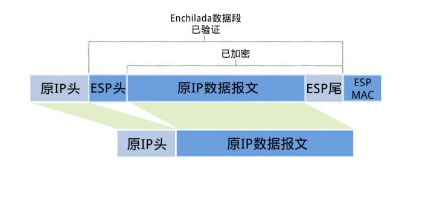
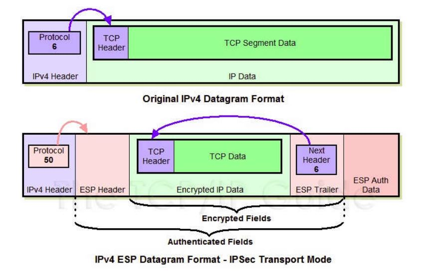
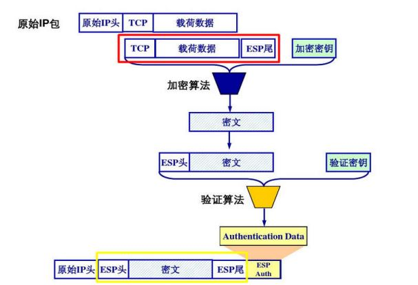
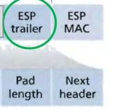
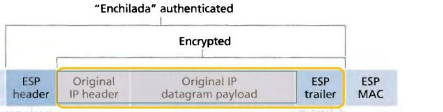
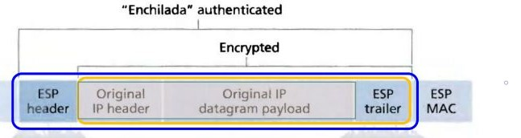
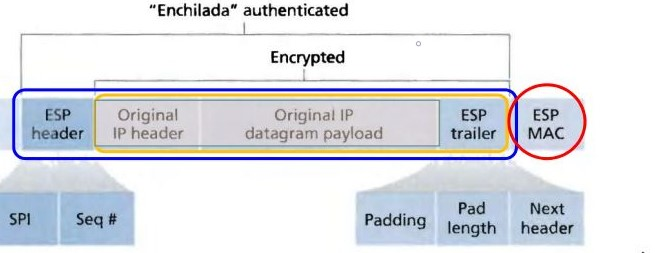
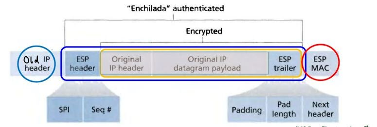

## Web安全技术 -- IPSec传输模式下ESP报文的装包拆包过程的准确描述

## 姓名：陈明亮

## 学号：16340023

## 一、IPSec简介
1. `IPSec`即网络协议安全协定`Internet Protocol Security`，由`IETF`组织进行协定内容的定义与发布。`IPSec`被设计为对网络协议传输过程的安全性保证，透过对IP协议（互联网协议）的分组进行加密和认证来保护IP协议的网络传输协议族（一些相互关联的协议的集合），确保IP网络传输时每个`IP`包都得到加密与认证，同时在会话开始时建立双方的交互认证，且在会话期间进行密钥的协商，很大程度上保证的网络传输的安全性。

   ​

2. IPsec由两大部分组成：（1）建立安全分组流的密钥交换协议；（2）保护分组流的协议。前者为互联网金钥交换（`IKE`）协议。后者包括加密分组流的封装安全载荷协议（`ESP`协议）或认证头协议（`AH`协议）协议，用于保证数据的机密性、来源可靠性（认证）、无连接的完整性并提供抗重播服务。

   ​

3. `IPSec`设计意图为：(1) 入口对入口通信安全，在此机制下，分组通信的安全性由单个节点提供给多台机器（甚至可以是整个局域网; (2) 端到端分组通信安全，由作为端点的计算机完成安全操作。上述的任意一种模式都可以用来构建虚拟专用网 (VPN)，而这也是IPsec最主要的用途之一。

   ​

4. `IPSec`与其余的互联网安全协议相比可适用范围更加广，该协议工作在`OSI`模型的第三层，使其在单独使用时适于保护基于`TCP`或`UDP`的协议。这就意味着，与传输层或更高层的协议相比，IPsec协议必须处理可靠性和分片的问题，这同时也增加了它的复杂性和处理开销。相对而言，SSL/TLS依靠更高层的TCP（OSI的第四层）来管理可靠性和分片，但此些协议并不能完全保护`TCP`或`UDP`通信流的安全性。

   ​

## 二、ESP简介
1. `ESP`介绍
  `Encapsulating Security Payloaads`，封装安全载荷协议`ESP`是`IPSec`支持的两类传输安全协议中的一种。`ESP`协议能够在数据传输过程中对数据完整性进行检测与度量，同时进行数据来源的安全性认证与加密，很大程度上防止了回放攻击。

  ​

2. `ESP`传输模式介绍
  传输模式`Transport Mode`，是与隧道模式`Tunnel Mode`同为`IPSec`工作的两种信息传输方式，在这两种不同的工作模式下，`ESP`数据报的结构与装包/拆包机制也相应地发生改变。与隧道模式不同的是，传输模式下不会主动生成新的`IP`头部信息，而是服用原来的`IP`头，保护报文内部真正传输的内容数据，而不对整个`IP`报文进行保护。

  ​

3. `IPSec`传输模式下`ESP`报文结构示意图

  

  ​

4. 传输模式下`ESP`报文与原始`IPv4`报文的区别示意图

   

   ​

5. 传输模式下`ESP`数据包的认证与加密流程图

   

## 三、传输模式下ESP报文的装包与拆包过程准确描述

1. 装包过程分析
* 传输模式装包的起始步骤为原`IP`报文末尾添加尾部信息`ESP Trailer`。同时尾部信息包含三部分，每当所选的加密算法为块加密时，当最后一块长度不足时就需要进行填充操作`Padding`，附上填充长度`Padding Length`，方便接收方解包时顺利地找出用于填充操作的那一段数据。`Next Header`则用于标明封装的原报文的协议类型，过程示意图：

* 将原IP报文以及初始步骤得到的报文尾部`ESP Trailer`作为整体进行加密封装，封装采取的加密算法以及相应的密钥由SA给出。

* 为上一步得到的加密数据添加`ESP Header`，该头部信息由`SPI`和序列号`Seq#`两部分组成。原本的加密数据，以及新加的头部信息`ESP Header`合称为`Enchilada`，构成认证部分。需要引起注意的是，被封装的原报文的协议类型此时收到保护，由加密过后的`ESP Tariler`的`Next Header`声明，而不是以明文信息不出现在未加密的`ESP Header`中。

* 进行附加完整性度量结果检测`ICV (Integrity check value)`，对第三步得到的加密`Enchilada`部分进行认证，得到一个32位证书倍的完整性度量值`MAC`，并附加在`ESP`报文的尾部。同样地，完整性度量算法的认证密钥由SA给出。

* 传输模式下`ESP`数据装包的最后一步保留原报文的`IP Header`，组成最终发送出的`IPSec`报文。同时需要注意此处的报文协议类型须保证为50，说明封装内容为`ESP`报文。

2. 拆包过程分析
* 收到 ESP包后，进行的第一件事情是：检查处理这个包的SA是否存在，这是基本的 IPSec要求，而不是ESP专有的。如果没有SA，这个包就会被丢弃。只有在SA存在的情况下，才可开始进行输入处理。一旦验证通过了一个有效的SA，就可用它开始包的处理。

  ​

* 首先检查序列号。如果这个包的序列号是有效的，那么该包就不是一个重复（重播）的包，也不是出现在包含在S A中的序列号窗口的右边—就开始进行处理。由于`ESP`身份验证密文而不是明文，接下来进行的便是对这个包进行身份验证。利用恰当的密钥，把这个完整的ESP包（当然除开身份验证数据）传递到验证器那里（它取自SA）。如果其结果能与“身份验证数据”字段中包含的数据相符（将身份验证算法可能需要的任何分段考虑在内），就可对这个包进行身份验证。接下来是解密。通过取自SA的密钥和密码算法，就可对`ESP`包进行解密，这个ESP包在载荷数据开始之处到下一个头之间。判断解密成功的一个最简单的测试是检验其填充。由于填充内容具有决定意义—要么是一个从1开始的单向递增的数，要么通过加密算法来决定—对填充内容进行验证将决定这个包是否已成功解密。

  ​

* 下面分步骤对拆包过程进行分析与准确描述：

  1. 接收方收到 IP 报文后，发现协议类型是50，表明这是一个 ESP包。首先查看 ESP header，通过 SPI 决定数据报文所对应的 SA

  ，获得对应的模式 (tunnel/transport mode) 以及安全规范。

  2. 计算 “enchilada” 部分的摘要，与附在末尾的 ICV 做对比，验证数据完整性。
  3. 检查 Seq# 里的顺序号，保证数据是“新鲜”的。
  4. 根据 SA 所提供的加密算法和密钥，解密被加密过的数据，得到原 IP 报文与 ESP trailer。
  5. 根据 ESP trailer 的填充长度信息，找出填充字段的长度，删去后得到原来的 IP 报文。
  6. 最后根据得到的原 IP 报文的目的地址进行转发。